<div align="center">

<!-- ============ APP LOGO SLOT ============
     Replace docs/assets/logo.svg with your own logo (or change this path to docs/assets/logo.png).
     Keep it square, 512 x 512 px or larger. -->




**Photo in, certified grade out.** 1 to 5 mm blue sapphires graded on a 7-grade GEMCLOUD scale.

</div>

---

## Architecture

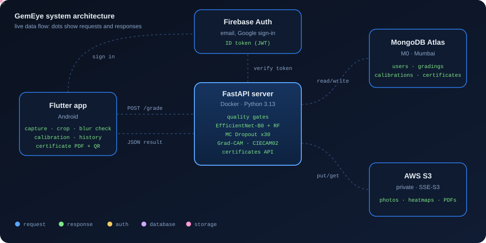

## Grading pipeline

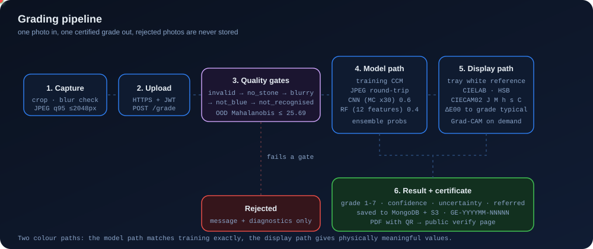

## Quality gates

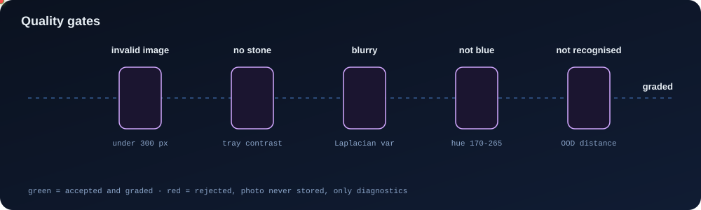

## Model

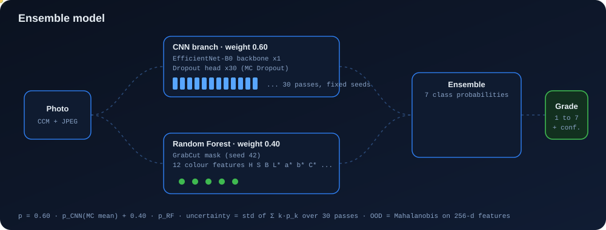

## Two colour paths

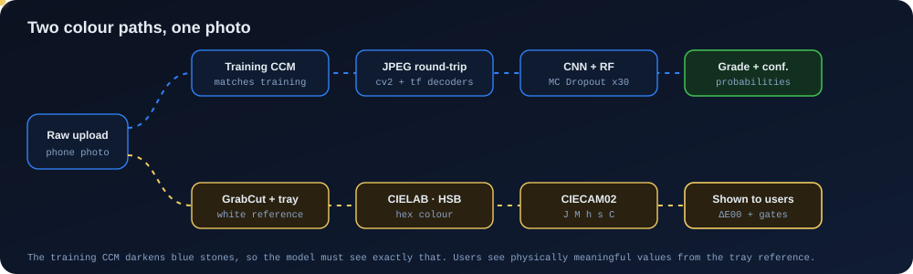

## Explainability


## Certificates

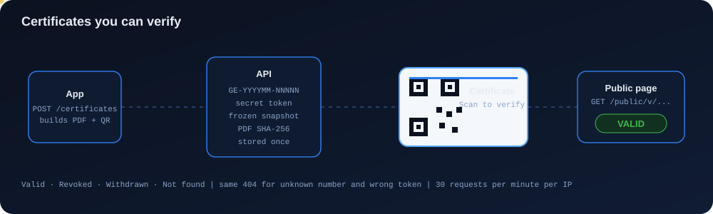

## Security

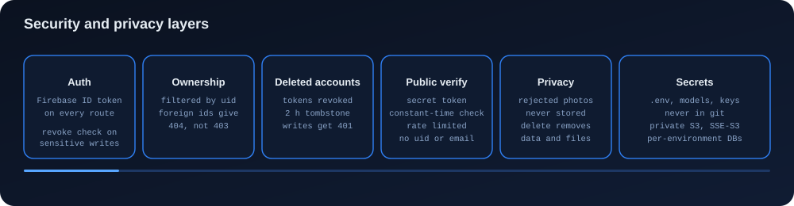

## Results


## API

19 endpoints: 3 public (`/health`, `/config`, `/public/v/{slug}`) and 16 authenticated. Interactive docs at `/docs`.

## Run locally

```bash
cd backend
docker compose up -d --build        # API on http://<LAN-IP>:8000
curl http://localhost:8000/health

cd ../app
flutter build apk --release --dart-define=API_BASE_URL=http://<LAN-IP>:8000
```

Needs `backend/.env` and `backend/models/` (not in git). Phone and laptop on the same Wi-Fi.

## Roadmap


<div align="center">

<sub>K.A.S. Nirmana · BSc (Hons) Computer Science · NSBM Green University · Research project</sub>

</div>
