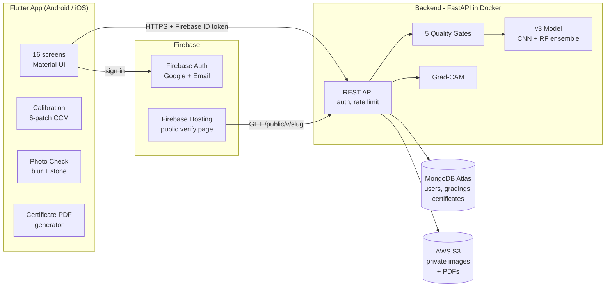
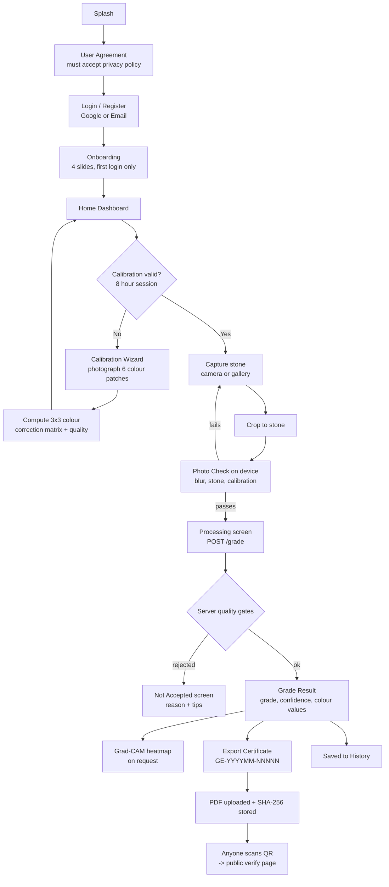
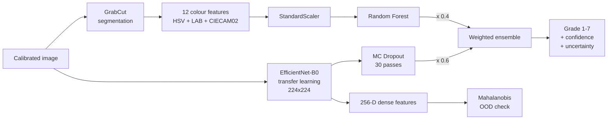

# GemEye - Final Year Project Presentation Guide

**Automated colour grading of blue sapphires with a smartphone, deep learning and colour science**

| | |
|---|---|
| Student | Nirmana K.A.S. |
| Degree | BSc (Hons) Computer Science, NSBM Green University |
| Industry partner | Orava (Pvt) Ltd., Sri Lanka |
| Platform | Flutter mobile app (Android + iOS) + Python FastAPI backend |
| Model version | v3 (EfficientNet-B0 CNN + Random Forest ensemble) |

Each section below is one slide or a small group of slides. Bullet points are written as slide content; the "Speaker notes" lines give the detail to say aloud.

---

## 1. The Problem

- Sri Lanka is one of the world's main sources of blue sapphire, and **colour is the biggest driver of a sapphire's value**.
- Colour grading today is done **by eye**, by experienced graders under controlled light.
- Small stones (**1-5 mm cut and polished**) are especially hard: tiny area, strong reflections, dark facets.
- Problems with manual grading:
  - **Subjective**: two graders can give different grades to the same stone.
  - **Not repeatable**: depends on light, fatigue and the background.
  - **Slow and expensive**: needs trained experts, and small traders often cannot get them.
  - **No digital record**: no proof of what grade was given, or when.

**Speaker notes:** Orava handles large volumes of small calibrated sapphires. Grading each one by eye is the bottleneck, and buyers have no objective, verifiable record of the colour grade.

---

## 2. The Solution - GemEye

> A mobile app that photographs a sapphire on a standard tray, sends it to an AI grading server, and returns one of **7 GEMCLOUD colour grades** with a confidence score, measured colour values, a visual explanation (Grad-CAM) and a **verifiable PDF certificate**.

Core idea in one line: **calibrated photo -> quality checks -> AI ensemble -> colour grade + certificate**.

### Project objectives
1. Grade 1-5 mm blue sapphires into 7 GEMCLOUD colour grades automatically.
2. Make results repeatable through colour calibration and strict photo quality checks.
3. Be honest about uncertainty: show confidence, and **refer** low-confidence stones to a human expert.
4. Explain the AI's decision (Grad-CAM heatmap).
5. Produce a tamper-evident certificate that anyone can verify online.
6. Keep user data secure and private (authentication, private storage, account deletion).

---

## 3. The 7 GEMCLOUD Colour Grades

Always 7 grades, ordered dark to light.

| Grade | Name | Trade name | Reference colour |
|---|---|---|---|
| 1 | Dark | Midnight Blue | `#020519` |
| 2 | Deep | Twilight Blue | `#0B0F3F` |
| 3 | Vivid | Royal Blue | `#091A72` |
| 4 | Intense | Intense Cornflower | `#2A408C` |
| 5 | Medium Intense | Cornflower Blue | `#47619E` |
| 6 | Light | Pastel Blue | `#718BB7` |
| 7 | Very Light | Very Light Blue | `#ABBDD6` |

**Speaker notes:** Grade data ships with the app (`assets/data/colour_grades.json`), so the Colour Guide works offline.

---

## 4. System Architecture (Overview)

- **Three tiers**: mobile client, Python API server, cloud data stores.
- The app **never talks to the database directly**. All data goes through the authenticated REST API, so no database credentials live in the app.
- Every request carries a **Firebase ID token**, which the server verifies.

---

## 5. Full Workflow (End to End)

### Step by step
1. **Onboarding and consent** - the user must accept the privacy policy before using the app. A new policy version forces a fresh acceptance.
2. **Sign in** - Firebase Authentication (Google Sign-In or email and password). Accounts can be Individual or Company.
3. **Calibrate** - the user photographs 6 reference patches (white, black, 18% grey, 50% grey, blue, red). The app computes a colour correction matrix and rates it Excellent / Acceptable / Poor. A session is valid for 8 hours.
4. **Capture** - the stone is photographed on the tray, then cropped.
5. **Photo Check (on device)** - blocks blurry photos, missing stones and expired calibration **before** anything is uploaded. Its blur score is bit-identical to the server's.
6. **Grade** - the photo goes to `POST /grade`. The server runs 5 quality gates, then the AI ensemble.
7. **Result** - the grade, confidence, uncertainty, second most likely grade, measured colour values and ΔE₀₀ to the grade's typical colour.
8. **Explain** - Grad-CAM heatmap of where the CNN looked.
9. **Certify** - on first export the server issues a unique certificate number; re-exports always reuse it.
10. **Verify** - a QR code on the certificate opens a public web page that checks the certificate with the server.

---

## 6. Key Features

### Grading features
| Feature | What it does |
|---|---|
| **AI colour grading** | 7-grade classification by a CNN + Random Forest ensemble |
| **Confidence and uncertainty** | Ensemble probability plus Monte Carlo Dropout uncertainty |
| **Referral system** | Stones below the user's confidence threshold (default 0.60, adjustable 0.40-0.90) are flagged **Referred** for a human expert |
| **Second grade** | Shows the next most likely grade for borderline stones |
| **Colour measurements** | CIELAB L*, a*, b*, Chroma C*, Hue, Saturation, Brightness, hex swatch, CIECAM02 |
| **ΔE₀₀ (CIEDE2000)** | Perceptual colour distance from the stone to the typical colour of its grade |
| **Grad-CAM explanation** | Heatmap overlay showing which image regions drove the CNN's decision |
| **Repeatability Mode** | Captures the same stone 3 times; shows agreement (n/3), max ΔE₀₀ between captures and a final majority grade |
| **Stone Comparison** | Two stones side by side with ΔE₀₀ between them |

### Quality and trust features
| Feature | What it does |
|---|---|
| **Colour calibration** | 6-patch colour correction matrix per session, with a quality verdict and history |
| **On-device Photo Check** | Rejects blurry or empty photos before upload |
| **5 server quality gates** | invalid_image, no_stone, blurry, not_blue, not_recognised (out-of-distribution) |
| **Not Accepted screen** | Explains why a photo was rejected and how to fix it |

### Certificate features
| Feature | What it does |
|---|---|
| **Unique certificate number** | `GE-YYYYMM-NNNNN`, from an atomic monthly counter on the server |
| **Same number on re-export** | A stone never gets a second certificate number |
| **A4 PDF / PNG export** | Save, share or print; format set in Settings (PDF, Image or Both) |
| **Public verification** | QR code -> web page; secret token per certificate; frozen snapshot of the result |
| **Tamper evidence** | SHA-256 hash of the PDF is stored on the server |
| **Revocation** | The owner can revoke; deleted accounts show "withdrawn" |
| **Privacy choice** | The owner's name/company appears only if they opt in |

### Account, data and app features
- **Grading History** with search, filters (grade, referred, date), sort, batch export and certificate badges.
- **Colour Grade Guide** (offline reference for all 7 grades).
- **Home Dashboard** with a time-based greeting, calibration banner, quick grade card, stats and recent grades.
- **Settings** (14 items): referral threshold, export format, biometric lock, notifications, server status, API base URL and more.
- **Security**: biometric lock (fingerprint/PIN), change password, change email, re-authentication for sensitive actions.
- **Account deletion** removes all images, gradings, calibrations and feedback, and the Firebase user.
- **Offline handling**: offline banner, cached history, capture disabled while offline.
- **In-app notifications** with fixed IDs per category (authentication, calibration, grading, certificate and so on).
- **Feedback** (rating + category + comment) sent to the server.
- **Remote config**: maintenance mode, feature flags and thresholds changed without an app update.

---

## 7. The App - 16 Screens

| # | Screen | Purpose |
|---|---|---|
| 1 | Splash | Lottie animation, 3 s |
| 2 | User Agreement | Must accept the privacy policy to continue |
| 3 | Login / Register | Google Sign-In + Email; Individual or Company account |
| 4 | Onboarding | 4-slide intro, first login only |
| 5 | Home Dashboard | Greeting, calibration status, quick grade, stats, recent grades |
| 6 | Calibration Wizard | 6-patch capture, colour matrix, result + history |
| 7 | Capture | Camera/gallery, checklist, Pro mode guide, crop |
| 8 | Processing | Animated step-by-step progress while the server grades |
| 9 | Grade Result | Grade badge, confidence, probabilities, colour values, Grad-CAM |
| 10 | Certificate | A4 preview, save / share / print |
| 11 | Grading History | Search, filter, sort, certificate tracking |
| 12 | Colour Guide | 7-grade reference, offline |
| 13 | Stone Comparison | Side by side with ΔE₀₀ |
| 14 | Settings | 14 settings items |
| 15 | About | App, developer, university and company |
| 16 | Privacy Policy | Read-only policy text |

Supporting screens: Photo Check, Not Accepted, Repeatability Capture/Summary, Notifications, Profile, Change Email, Change Password, Calibration Patch and Calibration Result.

**Navigation**: bottom bar with 4 tabs (Home, Grade, History, Guide) plus a side drawer with 11 items (profile, Stone Comparison, Settings, Feedback, Privacy, About, Logout).

**Design system**: white backgrounds, Royal Blue `#1B3A8C` brand colour, Poppins headings, Inter body text, JetBrains Mono for colour values only. Light mode only, with a central theme class for colours and fonts.

---

## 8. Dataset

| Item | Value |
|---|---|
| Stone shapes | Round, Oval, Pear, Baguette |
| Raw images | 41 per shape per grade -> 4 x 7 x 41 = **1,148 images** |
| Balanced merged set | **161 images per grade** x 7 grades |
| Training set (unique after de-duplication) | **818 images** |
| Clean validation set | **94 images** |
| Test set | **112 images** (16 per grade); "clean-98" subset after removing 14 leaked near-duplicates |
| Labels | 7 GEMCLOUD grades |
| Calibration reference | Photos of the 6 Colour Checker patches under the training setup |

**Speaker notes:** A leakage check found 14 test images too similar to training images, so the results are also reported on the "clean-98" subset to be fair.

---

## 9. Image Processing and Colour Science (Deep Techniques)

### 9.1 Colour calibration - 3x3 Colour Correction Matrix (CCM)
- The user photographs 6 known patches: White (255,255,255), Black (0,0,0), 18% Grey (117), 50% Grey (186), Blue (0,63,135), Red (175,54,60).
- The app takes the mean RGB of the central 50% of each patch (a patch is rejected if it is too noisy: channel std > 0.06 x 255).
- **Least squares** fit of a 3x3 matrix M (no offset): `corrected = rgb x M`, the same as `numpy.linalg.lstsq` in training.
- Quality from the residual: Excellent <= 0.30, Acceptable <= 0.45, else Poor.
- Training CCM residual: **0.2548**.

### 9.2 Two separate colour paths on the server
| | Model path | Display path |
|---|---|---|
| Purpose | Feed the AI exactly as in training | Show true colour values to the user |
| Steps | Optional session map -> training CCM -> JPEG round trip | Resize 256 px -> GrabCut stone mask -> **tray white balance** (tray median scaled to 229.5) |
| Output | CNN input + 12 RF features | L*a*b*, C*, H/S/B, hex, CIECAM02, ΔE₀₀, gate values |
| Rule | Must be bit-for-bit identical to training | Physically meaningful values |

**Why two paths?** The model must see images processed exactly as during training, otherwise accuracy drops. The user needs physically sensible colour numbers. One pipeline cannot satisfy both.

### 9.3 Stone segmentation - GrabCut
- OpenCV **GrabCut** initialised with a rectangle (15% margin), 5 iterations, **fixed random seed 42** so the same image always gives the same mask.
- Fallbacks: saturation mask (S > 30) if the stone area < 5%, then a centre box if < 3%. A fallback marks the colour values as **approximate**.

### 9.4 12 colour features (for the Random Forest)
`H, S, B` (HSV) - `L*, a*, b*, C*` (CIELAB) - `J, M, h, s, C_cam` (CIECAM02 appearance model), each the **median over the stone pixels**.

### 9.5 Colour difference - CIEDE2000 (ΔE₀₀)
- The industry-standard perceptual colour difference formula, implemented in Dart and Python and unit tested against published reference pairs.
- Used for: distance to the grade's typical colour, stone-vs-stone comparison, repeatability agreement (<= 1 Excellent, <= 2 Good, else Poor) and the no_stone gate (stone vs tray contrast).

### 9.6 Blur detection - Laplacian variance
- Greyscale -> longer side 512 px -> central 50% -> Laplacian variance.
- Threshold **29.47** (from training data statistics). The app's Photo Check uses the same formula and the threshold comes from the server's `/config`, so the app and the server always agree.

---

## 10. The AI Model (v3)

### 10.1 Architecture - a hybrid ensemble

| Component | Details |
|---|---|
| **CNN** | EfficientNet-B0 pretrained on ImageNet, custom classification head (256-unit dense layer + Dropout + 7-way softmax), input 224x224 with EfficientNet preprocessing |
| **CNN training** | Two phases: (1) frozen backbone, head only, learning rate 5e-4; (2) fine-tuning with learning rate reduced down to 5e-6 (about 20 epochs each) |
| **Random Forest** | scikit-learn, trained on the 12 standardised colour features |
| **Ensemble** | `P = 0.6 x CNN + 0.4 x RF` (weights tuned on validation) |
| **Uncertainty** | **Monte Carlo Dropout**: 30 stochastic passes of the head; uncertainty = std of the expected grade |
| **Out-of-distribution detection** | **Mahalanobis distance** of the 256-D dense features vs. training statistics; warn at 20.65, reject at 25.69 (validation 99th percentile) |
| **Explainability** | **Grad-CAM** on the last convolution layer (`top_activation`) |

### 10.2 Why a hybrid?
- The **CNN** learns texture, facet patterns and overall appearance, but is a black box.
- The **Random Forest** uses explicit, interpretable colour-science features grounded in gemmology.
- Combining them was more accurate than either alone (see results).

### 10.3 Model evolution (versions)
| Version | RF accuracy | CNN accuracy | Ensemble |
|---|---|---|---|
| v1 | 33.9% | 84.8% | 83.9% |
| v2 (GrabCut features) | 65.2% | 67.0% | 77.7% |
| **v3 = v2 RF + v1 CNN** | **65.2%** | **84.8%** | **87.5%** (89.3% with test-time augmentation in Colab) |

**Speaker notes:** v2 improved the RF a lot by adding GrabCut segmentation, but its CNN got worse. v3 takes the best part of each version.

### 10.4 Engineering optimisation - MC Dropout speed-up
- Dropout exists only in the classification head, so the EfficientNet backbone runs **once** and only the small head runs 30 times as a single batch.
- CNN time per image: **about 1.8 s -> about 60 ms**. Total `/grade` time: **about 3.7 s -> under 1 s** on CPU (server side).
- Dropout masks use a fixed stateless seed, so **the same image always gives the same result** (deterministic and reproducible).

---

## 11. Results and Evaluation

### 11.1 Accuracy on the 112-image test set (server)
| Metric | Result |
|---|---|
| **Final ensemble accuracy (all 112)** | **87.50%** |
| Accuracy (clean-98, no leaked images) | **87.76%** |
| Macro-F1 | **0.873** |
| **Within +/- 1 grade** | **100%** |
| CNN deterministic accuracy | 84.82% |
| CNN MC Dropout accuracy | 83.04% |
| Random Forest accuracy | 66.07% |

**Key message:** every error is at most one grade away from the correct grade, and borderline stones are referred to an expert instead of being given a confident wrong grade.

### 11.2 Training-server parity (reproducibility)
The deployed server was tested against the Colab training reference on all 112 images:
| Check | Result |
|---|---|
| A. RF probabilities identical | **PASS** (112/112, max difference 5e-13) |
| B. CNN probabilities identical | **PASS** (112/112, max difference 2.85e-6) |
| C. Clean-98 accuracy matches | **PASS** (87.76%) |
| D. Every disagreement below referral threshold | **PASS** |

**Bug found by parity testing:** the server decoded JPEGs with OpenCV, but training used TensorFlow's decoder. This shifted CNN probabilities by up to 0.335. Switching to `tf.io.decode_jpeg` fixed it.

**Phone upload test:** grading downscaled phone-style uploads (max 2048 px, JPEG 95) agreed with full-size images on 109/112 stones.

### 11.3 Quality gates
| Test | Result |
|---|---|
| Real stones falsely rejected | **3 / 112** (first version: 69 / 112) |
| Blurred images rejected | 95-100% |
| Empty tray crops rejected | 100% |
| Recoloured red / green / yellow / grey stones rejected | 93% / 96% / 96% / 99% |
| Random noise / checkerboards rejected | 9 / 9 |

**Problem solved:** the first colour path clipped dark stones to black, so dark sapphires looked "not blue". Switching to **tray white balance** reduced false rejections from 69 to 3.

### 11.4 Grad-CAM analysis
- On the test set, heat on the stone is about **5x** what a uniform map would give, so the CNN clearly focuses on the stone.
- About 63% of the heat still falls on the tray and edges. This is reported honestly as a limitation of the CNN branch.

### 11.5 Testing summary
| Area | Tests |
|---|---|
| Backend (pytest, real Firebase/MongoDB/S3 test env) | **85 passed** |
| Flutter app (unit + widget tests) | **73 passed** |
| Static analysis (`flutter analyze`) | **0 issues** |
| Manual end-to-end test on an Android 13 phone | **Passed** |

---

## 12. Backend in Detail

### 12.1 Technology
- **FastAPI** (Python 3.13) served by **Uvicorn**, packaged with **Docker** (non-root container, models loaded once at startup).
- Library versions pinned to the exact training environment for reproducibility.

### 12.2 REST API
| Method | Endpoint | Purpose |
|---|---|---|
| GET | `/health` | Server and model status (public) |
| GET | `/config` | Remote config + blur threshold (public) |
| POST | `/grade` | Grade a stone photo (multipart upload) |
| GET / PUT / DELETE | `/me` | Profile, settings, account deletion |
| GET | `/gradings`, `/gradings/{id}` | History with cursor paging and filters |
| DELETE | `/gradings/{id}` | Delete a grading and its images |
| POST | `/gradings/{id}/heatmap` | Grad-CAM heatmap |
| POST / GET | `/calibrations` | Save and list calibration sessions |
| POST / GET | `/certificates` | Issue (or reuse) and list certificates |
| POST | `/certificates/{no}/pdf` | Upload the PDF once (SHA-256 stored) |
| POST | `/certificates/{no}/revoke` | Revoke a certificate |
| POST | `/feedback` | User feedback |
| GET | `/public/v/{slug}` | Public certificate verification (rate limited) |

### 12.3 Database - MongoDB Atlas (10 collections)
`users`, `gradings`, `rejections`, `calibrations`, `counters`, `certificates`, `feedback`, `app_config`, `audit_log`, `deleted_accounts`.

- **Atomic counters** (`find_one_and_update` with `$inc`) generate stone IDs (`GE-STONE-NNNNN`) and monthly certificate numbers.
- Unique indexes prevent duplicate gradings (`request_id`) and duplicate valid certificates per grading.
- A TTL index expires deleted-account tombstones after 2 hours.

### 12.4 Storage - AWS S3
- Private bucket with server-side encryption (SSE-S3).
- Stores the original stone photo, the Grad-CAM PNG, certificate PDFs and the certificate photo copy.
- The app only gets **presigned URLs valid for 10 minutes**.

### 12.5 Reliability features
- **Idempotent grading**: each attempt has a UUID `request_id`; a retry after a network failure returns the original result instead of grading twice.
- S3 upload and the database insert run **concurrently**; if either fails, the other is undone.
- Separate **development / test / production** environments (separate database and S3 prefix).
- **Maintenance mode** and feature flags through remote config, picked up within 60 s.
- App-side **ApiClient**: Firebase token refresh on 401, 10 s connect / 60 s receive timeouts, one automatic retry for GET requests.

---

## 13. Security and Privacy

| Area | Measure |
|---|---|
| Authentication | Firebase ID token required on every private endpoint; signature verified on the server |
| Sensitive actions | Token revocation checked; account deletion requires sign-in within the last 5 minutes |
| Deleted accounts | Refresh tokens revoked + tombstone so an old token cannot re-create the user |
| Data isolation | Users only see their own records; another user's ID returns 404 (never 403), so IDs cannot be guessed |
| Secrets | No database credentials in the app; server secrets kept in `.env` as `SecretStr`, never logged |
| Device storage | Calibration and profile data in **flutter_secure_storage** (encrypted) |
| App lock | Optional biometric lock (fingerprint/PIN) |
| Certificates | Random secret token per certificate, constant-time comparison, same 404 for every invalid link |
| Abuse protection | Rate limit on the public verification endpoint (30/min per IP); upload size limits (15 MB image, 5 MB PDF) |
| Privacy | Rejected photos are not stored; owner name on certificates is opt-in; full account and data deletion; audit log uses hashed user IDs |
| Consent | The app cannot be used without accepting the privacy policy |

---

## 14. Technologies and Libraries

### 14.1 Mobile app (Flutter / Dart)
| Library | Used for |
|---|---|
| Flutter SDK (Dart) | Cross-platform UI (Android + iOS) |
| `firebase_core`, `firebase_auth` | Authentication |
| `google_sign_in` | Google Sign-In |
| `http`, `http_parser` | REST API calls, multipart image upload |
| `image_picker` | Camera and gallery capture |
| `image_cropper` | Crop the stone after capture |
| `image` | On-device image processing (blur check, patch measurement) |
| `pdf` | A4 certificate generation |
| `printing` | Print and PDF-to-image rendering |
| `share_plus` | Share certificates |
| `path_provider`, `path` | File locations |
| `flutter_secure_storage` | Encrypted storage of sensitive data |
| `shared_preferences` | Non-sensitive preferences and offline cache |
| `local_auth` | Biometric lock |
| `connectivity_plus` | Offline detection |
| `device_info_plus` | Device model for calibration records |
| `lottie` | Splash and processing animations |
| `flutter_markdown` | Privacy policy rendering |
| `url_launcher` | External links |
| `intl` | Date formatting |
| `uuid` | Unique request IDs |
| `flutter_native_splash`, `flutter_launcher_icons` | Native splash and app icons |
| `flutter_test`, `flutter_lints` | Testing and static analysis |

### 14.2 Backend (Python)
| Library | Used for |
|---|---|
| **FastAPI** + **Uvicorn** | REST API server |
| **TensorFlow 2.20 / Keras 3.13** | EfficientNet-B0 CNN inference, MC Dropout, Grad-CAM |
| **scikit-learn 1.6** | Random Forest + StandardScaler |
| **OpenCV 4.14** | GrabCut segmentation, colour conversion, blur detection |
| **colour-science 0.4.7** | CIECAM02 colour appearance model |
| **NumPy 2.1** | Numeric processing, least-squares CCM |
| **Pillow** | Image decoding |
| **joblib** | Loading the RF model and scaler |
| **pydantic-settings** | Typed configuration and secrets |
| **firebase-admin** | Verifying Firebase ID tokens, deleting users |
| **pymongo** | MongoDB Atlas access |
| **boto3** | AWS S3 storage and presigned URLs |
| **slowapi** | Rate limiting |
| **python-multipart** | File uploads |
| **pytest**, **httpx** | Automated tests |

### 14.3 Model training
- **Google Colab** (GPU), Python, TensorFlow/Keras, scikit-learn, OpenCV, colour-science.
- Transfer learning from ImageNet weights, in two phases (frozen backbone, then fine-tuning).

### 14.4 Infrastructure and tools
| Tool | Purpose |
|---|---|
| Firebase Authentication | User accounts |
| Firebase Hosting | Public certificate verification page |
| MongoDB Atlas | Cloud database |
| AWS S3 | Private image and PDF storage |
| Docker / Docker Compose | Reproducible backend environment |
| AWS Lambda + API Gateway (container image) | Planned production deployment |
| Git + GitHub | Version control |
| VS Code + Claude Code | Development |
| Android device testing (adb) | On-device testing |

---

## 15. Development Process

The project followed **incremental phases**, each tested before the next started:

| Phase | Work |
|---|---|
| A-B | Project setup, design system, splash, agreement, authentication, onboarding, home, navigation |
| C-E | Calibration, capture, processing, result, certificate PDF, history, comparison, guide, settings, about |
| UI redesign | Full redesign to an approved design system (Groups A-F) |
| 0 | Export of the trained v3 model and statistics from Colab |
| 1 | FastAPI inference server in Docker + MC Dropout speed-up |
| 2 | Parity testing against Colab (found and fixed the JPEG decoder bug) |
| 3 | 5 quality gates + tray white balance |
| 4 | Firebase auth, MongoDB, S3, certificates, public verification, account deletion, remote config |
| 5 | App connected to the real backend (idempotent grading, history sync) |
| 6 | Phone-upload parity, fixes, manual end-to-end test |
| 8 | Grad-CAM explainability |
| 9 | Local Wi-Fi demo setup; cloud deployment planned |

- Every change was logged in `PROJECT_STATUS.md` (over 110 logged edits) with topic, files and reason.
- Coding standards and rules were fixed in a project instruction file (`CLAUDE.md`).

---

## 16. Challenges and How They Were Solved

| Challenge | Solution |
|---|---|
| Different phones and lighting give different colours | 6-patch colour calibration + tray white balance |
| Server results differed from training | Parity test harness; found a JPEG decoder mismatch and fixed it |
| Dark stones falsely rejected as "not blue" (69/112) | Tray white-balanced colour path -> 3/112 |
| MC Dropout too slow (3.7 s per grade) | Run the backbone once, batch only the head -> under 1 s |
| Random results from GrabCut and Dropout | Fixed seeds -> the same image always gives the same grade |
| AI can be confidently wrong | Referral threshold, uncertainty, OOD detection, second grade |
| Black-box AI | Grad-CAM heatmaps + interpretable Random Forest features |
| Duplicate gradings on network retry | Idempotent `request_id` |
| Certificate forgery | Secret verify token, SHA-256 of the PDF, revocation |
| Privacy and account deletion | Full cascade delete, tombstones, hashed audit log |

---

## 17. Limitations

- Trained on **one tray and lighting setup**; other setups need more data.
- Test set is small (112 images, 16 per grade).
- The Random Forest alone is weak (66%); most accuracy comes from the CNN.
- Grad-CAM is coarse (7x7 grid) and shows that the CNN also uses some tray/edge context.
- Production cloud deployment (AWS Lambda) is still in progress; the current demo runs the server locally.
- Dark grades (1-3) are hard to separate because dark facets lose colour information.

---

## 18. Future Work

- Deploy the backend to **AWS Lambda + API Gateway** with HTTPS.
- Collect more data across lighting setups, phones and stone shapes.
- Use session calibration in the model path (already built behind the `session_mapping` flag).
- On-device inference (an INT8 TFLite model has already been exported) for offline grading.
- Admin dashboard for certificate revocation and referred-stone review.
- Extend to other gem colours (pink, yellow, padparadscha sapphires).

---

## 19. Conclusion

- GemEye turns a smartphone into an **objective, repeatable sapphire colour grading tool**.
- A **hybrid deep learning + colour science** ensemble reaches **87.5% accuracy with 100% within +/- 1 grade**.
- **Trust by design**: calibration, quality gates, uncertainty, referral, explainability and verifiable certificates.
- A complete, secure, tested **full-stack system**: Flutter app, FastAPI backend, MongoDB, S3 and Firebase.

---

## 20. Demo Script (for the live presentation)

1. Open the app -> Splash -> Home (show the greeting and calibration banner).
2. Run a **calibration** (6 patches) -> show the quality verdict.
3. **Grade a stone** -> crop -> Photo Check -> Processing animation.
4. **Result**: grade, confidence, colour values, ΔE₀₀ -> open **Grad-CAM**.
5. **Export certificate** -> show the number `GE-YYYYMM-NNNNN` -> export again to show the same number.
6. Scan the **QR code** -> public verification page.
7. Show a **rejected photo** (blurry or empty tray) -> Not Accepted screen.
8. Show **History**, **Comparison** and the **Colour Guide**.

---

## Appendix - Likely Viva Questions

| Question | Short answer |
|---|---|
| Why EfficientNet-B0? | High accuracy for its size; fast on CPU; good transfer learning results on small datasets |
| Why add a Random Forest? | Interpretable colour-science features; the ensemble beats either model alone |
| How do you handle uncertainty? | MC Dropout (30 passes), referral threshold, OOD Mahalanobis check |
| How do you make it repeatable? | Calibration, fixed seeds, deterministic inference, Repeatability Mode |
| How do you know the server matches training? | Parity test: RF and CNN probabilities match to 5e-13 and 2.85e-6 |
| Why not connect the app to MongoDB directly? | It would expose database credentials; the REST API adds auth and validation |
| How is a certificate verified? | QR -> public page -> server checks the cert number + secret token; PDF hash stored |
| What is ΔE₀₀? | CIEDE2000, the standard perceptual colour difference; about 1 is barely visible |
| What happens to low-confidence stones? | Marked **Referred** for a human expert, never silently graded |
